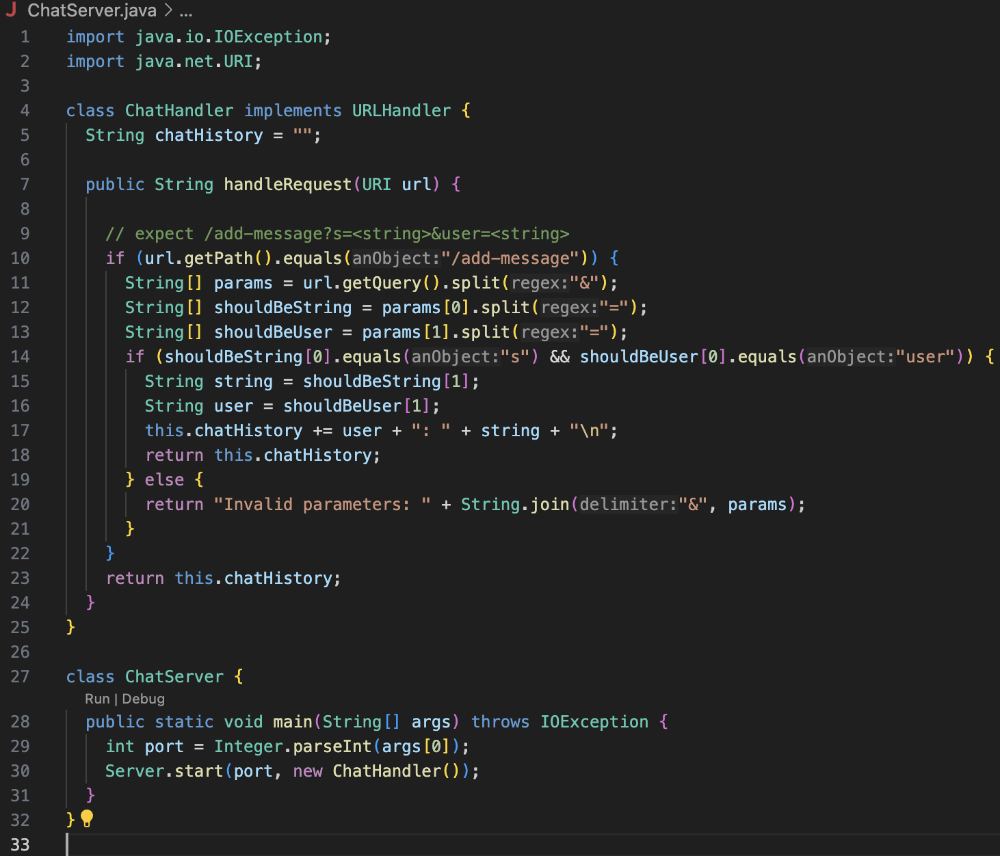
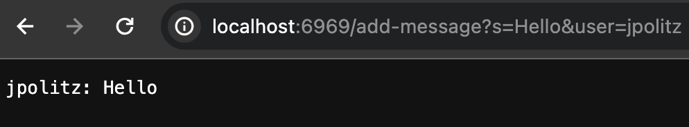
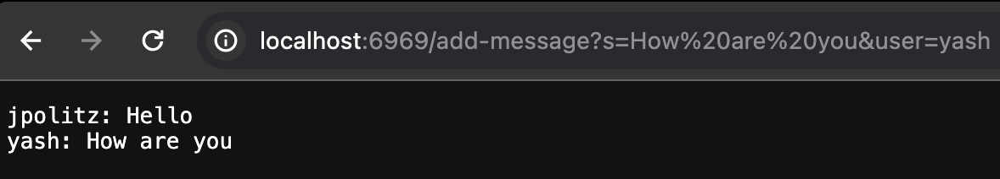
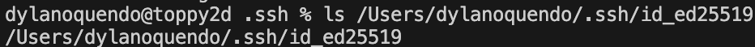
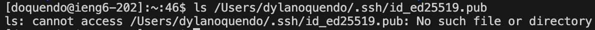
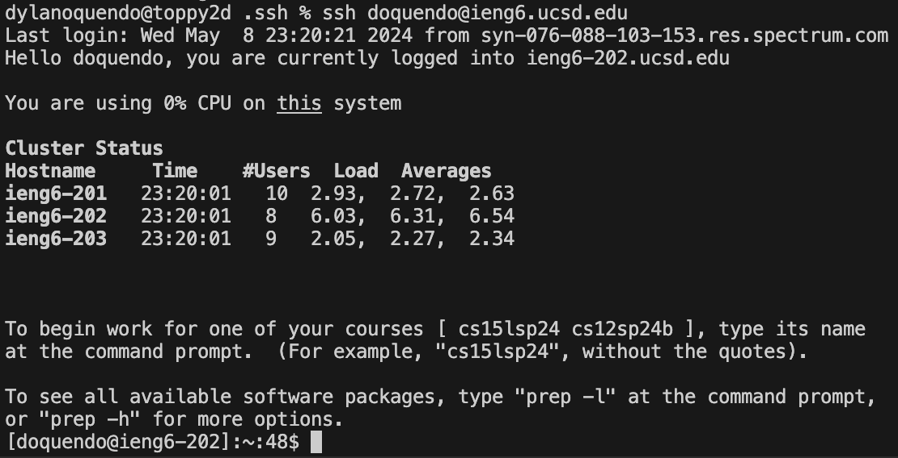

# Lab Report 2
#### Part 1

First, the main method is used to start the server with a given port number.
Then, after using the website with URI url as `/add-message?s=Hello&user=jpolitz`, 
the `handleRequest(URI url)` method gets called with the website url with my given 
path. Then many more methods get called on the url and the specific path given,
such as `.getQuery()` on the url and `.split(&)` on the result of that, so that the 
message and user are split up within the `String[] params` field, and then `.split(=)`
on each of those so that the message and user `String[] shoudlBeString` and
`String[] shoudlBeUser` can be extracted from the path information. All so that the 
message `String string = shouldBeString[1]` and user `String user = shouldBeUser[1]`
info can be appropriately added to the `chatHistory` string.

After running using the website a second time with a different website path, a new
URI url is passed as `/add-message?s=How are you&user=yash` which will ultimately
result in a new message and user string by the end of `handleRequest` method. Since,
the path will be different, changing the result of `.getQuery()` in `String[] params`
which changes the rest of the results from `.split()` for `String[] shoudlBeString`,
`String[] shoudlBeUser`, `String string = shouldBeString[1]`, and 
`String user = shouldBeUser[1]`. Then, the new message and user get added to the same
`chatHistory` string.

#### Part 2

#### Part 3

I did not know how to set up a github repo website and I did not know how to make a ChatServer
before this either. I also did not know how servers really worked, or how remote connections
worked, and I probably still don't but at least I'm more familiar with such.
